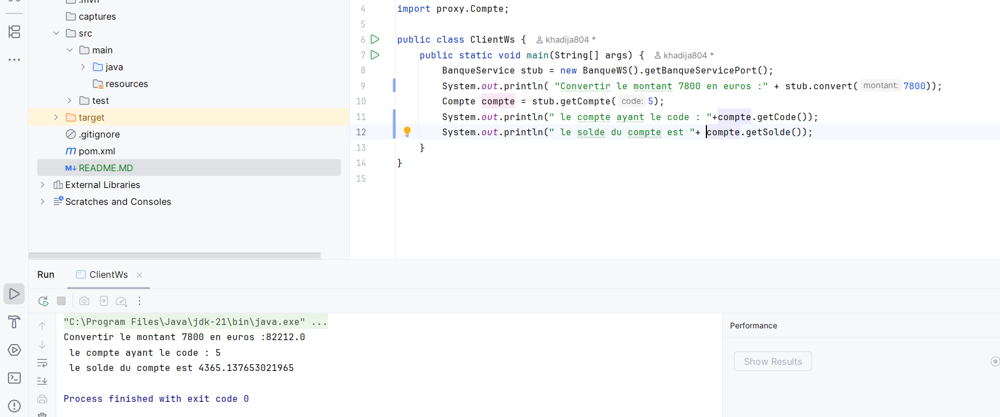

<H3> Client web service SOAP WSDL</H3>
Le client appelle le service Web disponible à l’adresse http://localhost:9191/BanqueWs?wsdl afin d’utiliser la fonction permettant de convertir un montant en euro et de récupérer les détails du compte numéro 5.
